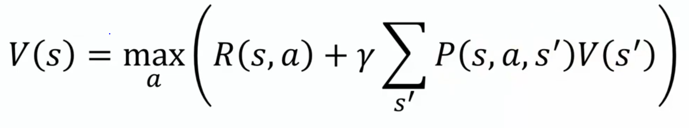

# Value Iteration

It is a method of computing an optimal MDP policy and its value. Value iteration starts at the "end" and then works backward, refining an estimate of either Q* or V*.

The Bellman equation is the basis of the value iteration algorithm for solving MDPs.
Let Ut(I) be the utility value for state s at the t'th iteration. The iteration step, called a Bellman update, looks like this:

